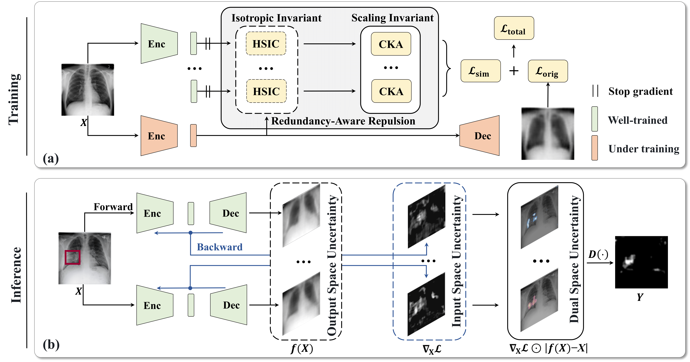
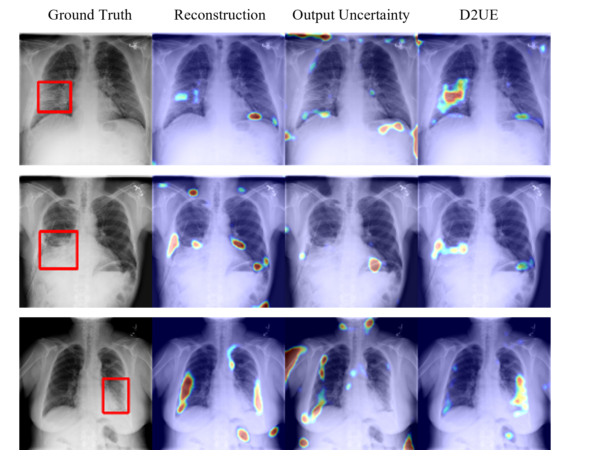

# D2UE
Official PyTorch implementation for our MICCAI 2024 early accepted paper: "Revisiting Deep Ensemble Uncertainty for Enhanced Medical Anomaly Detection"

**Illustration of the redundancy-aware repulsion and dual-space uncertainty:**
<p align="center">
  
</p>

<b>(a)</b>:An illustration of redundancy-aware repulsion (RAR). Disagreement on anomalies is amplified between different learners’ feature spaces, while normal input converges to similar reconstructions guided by reconstruction training. <b>(b)</b>: A t-SNE plot of feature spaces from three learners on the anomaly. Feature spaces are pushed away by RAR during training. <b>(c)</b>: An illustration of dual-space uncertainty (DSU) in 1D regression with two learners. Utilizing output space uncertainty fails to differentiate the anomaly at the upper point. In comparison, DSU utilizes the disagreement on $\nabla_{X}{f}$ to detect such anomalies.

**Overview of D2UE:**
<div align="center">
  
</div>

In the training stage, the redundancy-aware repulsion (RAR) module amplifies the diversity of different models with both isotropic and scaling invariance. In the inference stage, the dual-space uncertainty is calculated, utilizing both $f(X)$ in the output space and $\nabla_{X}\mathcal{L}$ in the input space.

**Visualization results**
<div align="center">
  
</div>

## Data Preparation

Organize the Med-AD benchmarks manually follow the [guidance](https://github.com/caiyu6666/DDAD-ASR/tree/main/data).


## Environment

- NVIDIA GeForce RTX 3090
- Python 3.8.16
- Cuda 11.7
```
conda create --name d2ue python=3.8.16
conda activate d2ue
pip install torch==2.0.0+cu117 --index-url https://download.pytorch.org/whl/cu117
```
### Packages

```
pip install -r requirements.txt
```


## Train and Evaluate

All scripts are available in `scripts/`, and configuration files are in `cfgs/`.
For example, you can choose to train and evaluate the method on RSNA dataset using AE as the backbone: `./scripts/RSNA_AE.sh`


The trained models and results are available [here](https://github.com/Rubiscol/D2UE/releases/tag/publish).


## Acknowledgement

We appreciate these open-source codes and datasets for implementing our paper:

### Codes

1. https://github.com/caiyu6666/DDAD-ASR
2. https://github.com/jayroxis/CKA-similarity

### Datasets

1. [RSNA Pneumonia Detection Challenge dataset](https://www.kaggle.com/c/rsna-pneumonia-detection-challenge)
2. [Vin-BigData Chest X-ray Abnormalities Detection dataset (VinDr-CXR)](https://www.kaggle.com/c/vinbigdata-chest-xray-abnormalities-detection)
3. [Brain Tumor MRI dataset](https://www.kaggle.com/datasets/masoudnickparvar/brain-tumor-mri-dataset)
4. [Large-scale Attention-based Glaucoma (LAG) dataset](https://github.com/smilell/AG-CNN)


## Citation

If this work is helpful for you, please cite our papers:

```

```
