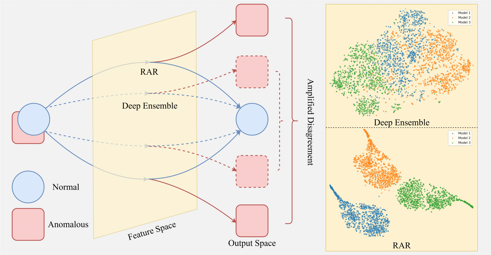
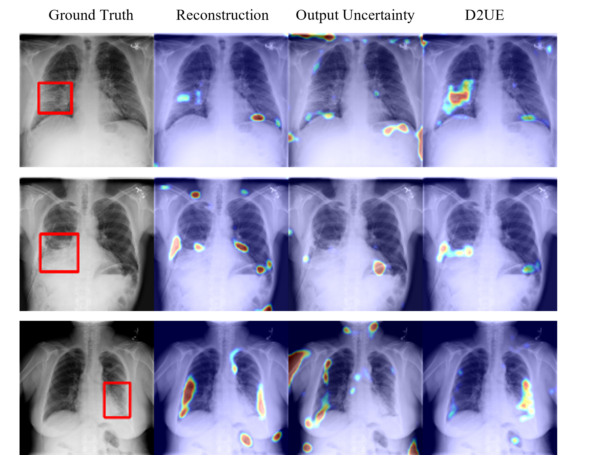

# D2UE
Official PyTorch implementation for our paper "Revisiting Deep Ensemble Uncertainty for Enhanced Medical Anomaly Detection"

**An overview of our method:**

  

Overview of D2UE: (a) During training, a junior learns through a feature path that is distinct from those of all its seniors. (b) During the inference stage, DSU incorporates both output and input-gradient information into the uncertainty estimation. (c) An illustration of over-generalization problem in the output space in 1D regression with two neural networks. The red region represents anomaly while the blue region represents normal data. Two functions output the same at the bottom point, despite divergent directions.

**A simple illustration of the redundancy-aware repulsion:**

  

Illustration of redundancy-aware repulsion (RAR). <b>Left</b>: During inference, all learners reconstruct samples from repulsed feature spaces to output space. In output space, normal features converge to agreement guided by the reconstruction training while the anomaly's disagreement is amplified. <b>Right</b>: A t-SNE plot of feature spaces from three learners on the anomaly. Feature spaces are repulsed by the redundancy-aware repulsion during training.

**Visualization results**

  

